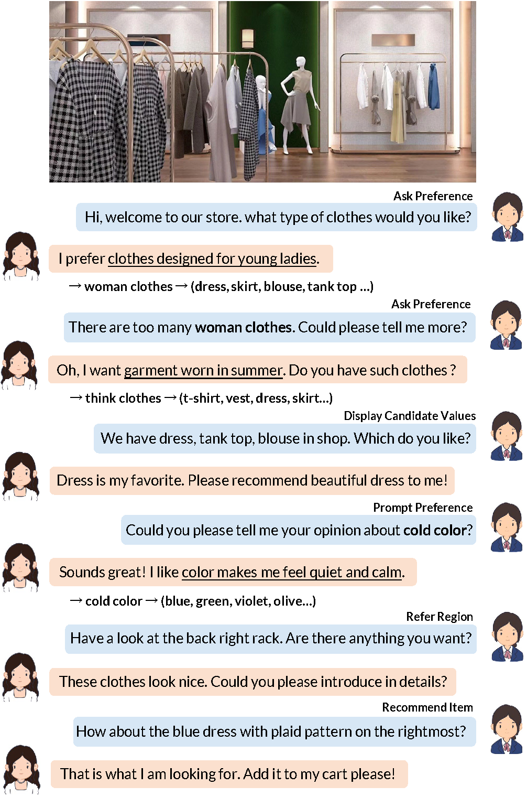

# Multimodal Recommendation Dialog with SUbjective PREference (SURE) 

We introduces a new dataset SURE (Multimodal Recommendation Dialog with SUbjective PREference), which contains 12K shopping dialogs in complex store scenes. The data is built in two phases with human annotations to ensure quality and diversity. SURE is well-annotated with subjective preferences and recommendation acts proposed by sales experts. A comprehensive analysis is given to reveal the distinguishing features of SURE. Three benchmark tasks are then proposed on the data to evaluate the capability of multimodal recommendation agents. Based on the SURE, we propose a baseline model, powered by a state-of-the-art multimodal model, for these tasks. 

<figure>
 
<figcaption><i>Illustration of the SURE Dataset</i></figcaption> 
</figure>
